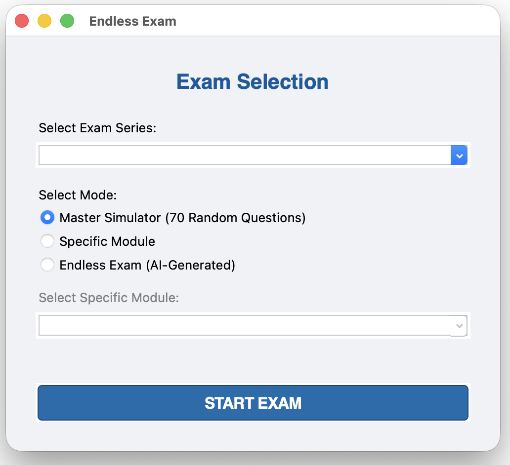
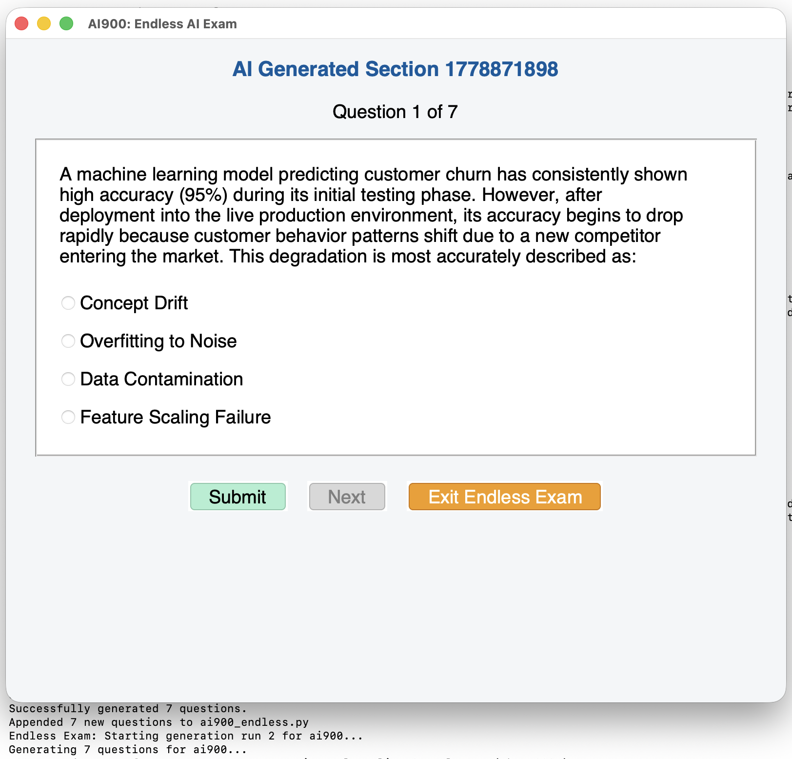

# 🎓 Endless Exam: AI-Powered Certification Prep

**Endless Exam** is a study and training application designed for software engineers and IT professionals preparing for Microsoft certifications and other technical exams. By leveraging the power of Artificial Intelligence, the project provides a dynamic, challenging, and adaptive learning environment.

---

## 🚀 Project Overview

This project is intended to be used for **exam preparation and training purposes only**. 

### ⚠️ Disclaimer
- **AI-Generated Content:** All questions within this repository are AI-generated. While they are designed to be highly relevant to the specific exam objectives and domains, they **will never match actual exam questions**.
- **Study Best Practices:** This tool should be used as a supplement to your studies. To ensure success, always use this project in conjunction with **official Microsoft Learn documentation** and official training sources.
- **Accuracy:** While the AI strives for high quality, always cross-reference explanations with official technical documentation.

---

## Screenshots

### Exam Selection


### Practice Interface


---

## 🧠 The Endless Experience

What makes this project unique is its ability to interface with Large Language Models (LLMs). It supports any OpenAI-compatible endpoints for your models. But when integrated with local model providers like **LM Studio** or **Ollama**, the learning experience becomes:

- **Endless:** Generates new variations of questions as you study to prevent "memorizing the test."
- **Free:** No subscription costs or API tokens required when running locally.
- **Private:** Your study data stays on your machine.

---

## 🛠️ Prerequisites

- **Python 3.10+**
- **LM Studio** (Recommended for the "Endless" generative features)
- **macOS** (For the current native UI, cross-platform coming soon!)

---

## ⚡ Quickstart

1. **Clone the repository:**
   ```bash
   git clone https://github.com/your-repo/endless-exam.git
   cd endless-exam
   ```

2. **Set up a virtual environment:**
   ```bash
   python3 -m venv .venv
   source .venv/bin/activate
   ```

3. **Install dependencies:**
   ```bash
   pip install -r requirements.txt
   ```

4. **Run the Application:**
   ```bash
   python3 main_launcher.py
   ```

---

## 🏗️ Architecture & Data Layout

The project is structured with a clean separation between the UI logic and the exam data, allowing for easy extension to new certification paths.

### Data Layout
The `data/` directory contains structured Python modules for different exam paths, categorized by difficulty and scope:

- **MS-900 (Microsoft 365 Fundamentals):** 
  - `basic.py`, `broad.py`, `advanced.py`, `expert.py`
- **SC-900 (Security, Compliance, and Identity Fundamentals):**
  - `basic.py`, `broad.py`, `advanced.py`, `expert.py`
- **AI-900 (Azure AI Fundamentals):**
  - `ai900_endless.py` (Focuses on generative AI and ML concepts)
- **DP-750 (Azure Data Engineer):**
  - `dp750_expert.py` (Advanced Databricks and Data Engineering scenarios)

### Question Structure
Each data file follows a standardized dictionary format:
```python
{
    "q": "The question text?",
    "options": ["Option A", "Option B", "Option C", "Option D"],
    "answer": 1, # Index of the correct option
    "explanation": "Detailed reasoning for the answer..."
}
```

---

## 🖥️ User Interface & Platform Support

- **Current Support:** The native UI is currently optimized for **macOS**.
- **In Development:** We are actively working on a cross-platform UI to support **Linux** and **Windows**. 

---

## 🤝 Contributing

Comments, feedback, and pull requests are more than welcome! 

1. Fork the Project
2. Create your Feature Branch (`git checkout -b feature/AmazingFeature`)
3. Commit your Changes (`git commit -m 'Add some AmazingFeature'`)
4. Push to the Branch (`git push origin feature/AmazingFeature`)
5. Open a Pull Request

---

*Happy Studying!*